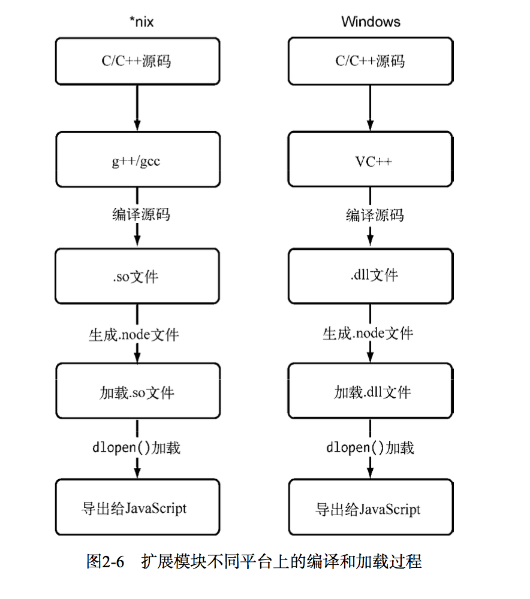
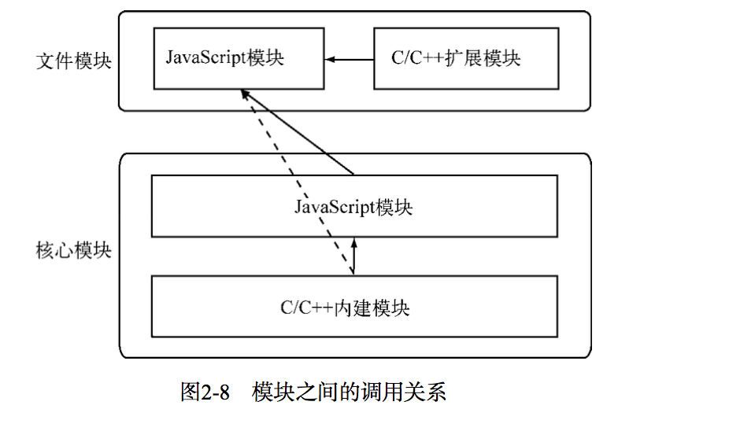

## CommonJS规范
commonjs规范希望JavaScript能够在任何地方运行，是JavaScript规范中的重要里程碑

### CommonJs的出发点
- Html5规范主要发生在前端， 后端JavaScript规范却远远落后，对于javascript自身而言，他的规范依旧是薄弱的，有以下缺陷
````
-没有模块系统
-标准库较少
-没有标准接口
-缺少包管理系统
````
CommonJS规范的提出，主要是为了弥补当前Javascript没有标准的缺陷，以达到像python，ruby和java具备开发大型应用的基础能力，而不停留在小脚本程序的阶段。
期望Commonjs API写出的应用可以具备跨宿主环境的执行能力，这样不仅可以利用javascript开发富客户端应用，而且还可以编写如下应用：
````
- 服务端javascript应用
- 命令行工具
- 桌面图形界面应用程序
- 混合应用
````

- 规范依旧时草案，但已初见成效，规范包含-模块，二进制，Buffer,字符集编码，I/O流，进程环境，文件系统，套接字，单元测试，web服务器网关接口，包管理等

- Node以一种较成熟的姿态出现，离不开CommonJs规范的影响

### Commonjs的模块规范
- 模块引用
var math = require('math')
require()方法引入一个模块API
- 模块定义
上下文提供了exports对象用于导出当前的方法或者变量，并且它是唯一导出的出口。在模块中，还存在一个module对象，它代表模块本身，而exports是module属性。在Node中，一个文件就是一个模块，将方法挂载在exports对象上作为属性即可定义导出模式。
````
math.js
exports.add = function(){
    ....
}
````

另一个文件中，我们通过require()方法引入模块后， 就能调用定义的属性或者方法了：
````
var math = require('math')
exports.increment = function(val){
    return math.add(val, 1)
}
````
3-模块标识
- 传递给require()方法的参数，必须是符合小驼峰命名的的字符串，或者以..开头的相对路径，可以不带后缀.js

### Node的模块实现
- Node并非完全按照规范实现，而对模块进行了一定的取舍，同时也增加了少许自身需要的特性。
> 在Node中引入模块，需要经历三个步奏
> 1-路径分析
> 2-文件定位
> 3-编译执行
- 模块分为两类-核心模块(Node自带的)和用户编写的模块(文件模块)
>核心模块在Node源代码编译过程中，编译进了二进制文件。
>文件模块则是运行时动态加载，需要完整的路径分析、文件定位、编译执行过程，速度比核心模块慢

- 优先从缓存加载
> 浏览器仅仅是缓存文件，而Node缓存的是编译和执行之后的对象
> 不论是核心模块还是文件模块，require()方法对相同模块的二次加载都采用缓存优先的方式，这是第一优先级的。不同之处在于核心模块的缓存检查先于文件模块的缓存检查

- 路径分析和文件定位
1-模块标识符分析
- 核心模块(http, fs, path)，相对和绝对路径模块，非路径形式的文件模块，如connect模块
- 非路径形式的模块查找最耗时，当前文件路径越深越耗时

2-文件定位
- 文件扩展名分析
> require()在分析标识符的过程中，会出现标识符中不出现文件扩展名的情况。这种情况下，Node会按.js/.json/.node的次序补足扩展名，依次尝试。在尝试的过程中，需要利用fs模块同步阻塞式地判断文件是否存在。因为Node是单线程的，所以这里是一个会引起性能问题的地方。解决诀窍：1-.node和.json在标识符上带上扩展名； 2-同步配合缓存，可以大幅度缓解Node单线程中阻塞式调用的缺陷

- 目录分析和包
> require()查找到是一个目录，将目录当做包处理-查找package.json,main属性文件错误或不存在package.json->将index当做默认文件名，index.js/index.json/index.node依次查找

- 模块编译
> 在Node中，每个文件模块都是一个对象，它的定义如下：
````
function Module(id, parent) { 
    this.id = id;
    this.exports = {}; 
    this.parent = parent;
    if (parent && parent.children) {
        parent.children.push(this);
    }
    this.filename = null; this.loaded = false; this.children = [];
}
````

> 定位到具体的文件后，Node会新建一个模块对象，然后根据路径载入并编译，不同的文件扩展名，载入方法不同
````
1-.js文件，通过fs模块同步读取文件后编译执行
2-.node文件，c/c++编写的扩展文件，通过dlopen()方法加载最后编译生成的文件
3-.json文件，通过fs同步读取文件后，用JSON.parse()解析返回结果
4-其余扩展名，都被当做.js载入
````

- 每一个编译成功的模块都会将其文件路径作为索引缓存在Module._cache对象上，以提高二次载入的性能:
> 根据不同的文件扩展名，Node会调用不同的读取方式，如.json文件调用如下：
````
// Native extension for .json
Module._extensions['.json'] = function(module, filename) {
    var content = NativeModule.require('fs').readFileSync(filename, 'utf8'); 
    try {
        module.exports = JSON.parse(stripBOM(content));
    } catch (err) {
        err.message = filename + ': ' + err.message; throw err;
    } 
};
````
> javascript模块的编译
事实上，在编译的过程中，Node对获取的JavaScript文件内容进行了头尾包装。在头部添加了
(function (exports, require, module, __filename, __dirname) {\n，在尾部添加了\n});。
示例如下：
````
(function (exports, require, module, __filename, __dirname) 
{ var math = require('math');
    exports.area = function (radius) {
        return Math.PI * radius * radius; 
    };
 });
 ````
 这样每个模块之间都进行了作用域隔离。包装之后的代码会通过vm原生模块的
runInThisContext()方法执行(类似eval，只是具有明确上下文，不污染全局)，返回一个具体的function对象。最后，将当前模块对象的exports属性、require()方法、module(模块对象自身)， 以及在文件定位中得到的完整文件路径和文件目录作为参数传递给这个function()执行。至此，require、exports、module的流程已经完整，这就是Node对CommonJS模块的实现。

exports和module.exports-exports形参形式传入，不能改变外面作用域的值，请赋值给module.exports


> c/c++模块编译
.node的模块文件并不需要编译，因为它是编写C/C++模块之后编译生成的，所以这里只有加载和执行的过程。在执行的过程中，模块的exports对象与.node模块产生联系，然后返回给调用者

> JSON文件的编译
fs->json.parse()->module.exports


- 核心模块
>  核心模块其实分为C/C++编写的和JavaScript编写的两部分，其中C/C++文件存放在Node项目的src目录下， JavaScript文件存放在lib目录下
> javascript核心模块的编译过程
javascript(v8:js2c.py)=>源文件通过process.binding('natives')取出，编译成功的模块缓存到NativeModule._cache对象上，文件模块缓存到Module._cache对象上=>c/c++
> c/c++核心模块的编译过程
Node的buffer、crypto、evals、fs、os等模块都是部分通过C/C++编写的
1-内建模块的组织形式
在Node中，内建模块的内部结构定义如下：
```` 
struct node_module_struct {
    int version;
    void *dso_handle;
    const char *filename;
    void (*register_func) (v8::Handle<v8::Object> target); 
    const char *modname;
};  
````
一个内建模块在定义之后，都通过NODE_MODULE宏将模块定义到node命名空间中，模块的具体初始化的方法挂载为结构的register_func
````
#define NODE_MODULE(modname, regfunc) \ 
extern "C" { \ 
NODE_MODULE_EXPORT node::node_module_struct modname ## _module = \ 
    {\ 
        NODE_STANDARD_MODULE_STUFF, \ 
        regfunc, \ 
        NODE_STRINGIFY(modname) \ 
    }; \
} 
````
node_extensions.h文件将这些散列的内建模块统一放进了一个叫node_module_list的数组中，
这些模块有 
````
  node_buffer   node_crypto   node_evals   node_fs
  node_http_parser   node_os
  node_zlib
  node_timer_wrap   node_tcp_wrap
  node_udp_wrap
  node_pipe_wrap
  node_cares_wrap
  node_tty_wrap
  node_process_wrap   node_fs_event_wrap   node_signal_watcher
````
这些内建模块的取出也十分简单。Node提供了get_builtin_module()函数从node_module_list数组中取出这些模块。
内建模块的优势在于：首先 ，它们本身由C/C++编写，性能上优于脚本语言;其次，在进行文件编译时，它们被编译成二进制文件。
一旦Node开始执行，它们被直接加载在内存中，无须再次做标识符定位、文件定位、编译过程， 直接就可执行。

2-内建模块的导出
内建模块-》核心模块-》文件模块
Node在启动时，会生成一个全局变量process，并提供Binding()方法来协助加载内建模块。 Binding()的实现代码在src/node.cc中， 具体如下：
````
static Handle<Value> Binding(const Arguments& args) { 
HandleScope scope;
Local<String> module = args[0]->ToString(); 
String::Utf8Value module_v(module); 
node_module_struct* modp;
if (binding_cache.IsEmpty()) {
    binding_cache = Persistent<Object>::New(Object::New());
}
Local<Object> exports;
if (binding_cache->Has(module)) {
    exports = binding_cache->Get(module)->ToObject(); 
    return scope.Close(exports);
}
// Append a string to process.moduleLoadList char buf[1024];
snprintf(buf, 1024, "Binding %s", *module_v); 
uint32_t l = module_load_list->Length(); 
module_load_list->Set(l, String::New(buf));
if ((modp = get_builtin_module(*module_v)) != NULL) { 
    exports = Object::New(); 
    modp->register_func(exports); 
    binding_cache->Set(module, exports);
} else if (!strcmp(*module_v, "constants")) { 
    exports = Object::New(); DefineConstants(exports); 
    binding_cache->Set(module, exports);
#ifdef __POSIX__
} else if (!strcmp(*module_v, "io_watcher")) {
    exports = Object::New(); IOWatcher::Initialize(exports); 
    binding_cache->Set(module, exports);
#endif
} else if (!strcmp(*module_v, "natives")) { 
    exports = Object::New(); DefineJavaScript(exports); 
    binding_cache->Set(module, exports);
} else {
    return ThrowException(Exception::Error(String::New("No such module"))); }
    return scope.Close(exports); 
}
````
在加载内建模块时，我们先创建一个exports空对象，然后调用get_builtin_module()方法取出内建模块对象 ，通过register_func()填充exports对象，最后将exports对象按照模块名缓存，并返回给调用方完成导出。

> 核心模块的引入流程
require("os")<=NativeModule.require("os")<=process.binding("os")<=get_builtin_module("node_os")<=NODE_MODULE(node_os,reg_func);

> 编写核心模块
示例：
````
功能：exports.sayHello = function () { return 'Hello world!';};

编写内建模块分两步：
(1) 将一下代码保存为node_hello.h,存放到Node的src目录：
````
#ifndef NODE_HELLO_H_ 
#define NODE_HELLO_H_ 
#include <v8.h>
namespace node {
//  定义方法
v8::Handle<v8::Value> SayHello(const v8::Arguments& args);
} 
#endif
````
(2)编写node_hello.cc, 并存储到src目录：
````
#include <node.h> #include <node_hello.h> #include <v8.h>
namespace node {
using namespace v8;
// 实现 定义的方法
Handle<Value> SayHello(const Arguments& args) {
HandleScope scope;
return scope.Close(String::New("Hello world!")); }
// 给传入的目 对象 加sayHello方法 void Init_Hello(Handle<Object> target) {
target->Set(String::NewSymbol("sayHello"), FunctionTemplate::New(SayHello)->GetFunction()); }
}
// 调用NODE_MODULE()将注 方法定义 内存中 NODE_MODULE(node_hello, node::Init_Hello)
````
以上两步了完成了内建模块的编写，但是真正要让Node认为它是内建模块，还需要更改src/node_extensions.h ， 在NODE_EXT_LIST_END 前添加 NODE_EXT_LIST_ITEM(node_hello) ， 以将node_hello模块添加进node_module_list数组中. 其次，还需要让编写的两分代码编译进执行文件，同时
需要更改Node的项目生成文件node.gyp,并在‘target_name’:'node'节点的sources中添加上新编写的文件。然后编译整个Node项目。编译和安装后，直接
在命令行中运行如下代码，将会得到期望的效果：
````
$ node
> var hello = process.binding('hello');
undefined
> hello.sayHello();
'Hello world!'
>
````
### c/c++扩展模块
- JavaScript的一个典型弱点就是位运算。JavaScript的位运算参照Java的位运算实现，但是Java位运算是在int型数字的基础上进行的，而JavaScript中只有double型的数据类型，在进行位运算的过程中， 要将double类型转为int类型，然后再进行。 所以，在JavaScript层面上做位运算的效率不高，这时候可以利用c/c++扩展模块来提升性能


- 前提条件
    - GYP项目生成工具-generate your project
    node自身的源码就是通过GYP编译的，-node_gyp-npm install -g node-gy
    - v8引擎c++库
    - libuv库-跨平台
    - Node内部库
    - 其他库 deps目录下如zlib，openssl、http_parser等

- 加载流程
> *nix:c/c++源码=>g++/gcc=>.so文件=》生成.node文件=》加载.so文件=>dlopen()加载=》导出给javascript
> windows: c/c++源码=》vc++=>编译源码=>.dll文件=>dlopen()加载=》导出给javascript
> 加载.node文件实际上经历了两个步奏，第一个步奏是调用uv_dlopen()方法打开动态连接 ，第二个步奏是调用uv_dlsym()方法找到动态链接库中通过NODE_MODULE宏定 的方法地址。这两个过程都是通过libuv库进行的封装: 在*nix平台下实际上调用的是dlfcn.h头文件中定义的dlopen()和dlsym()两个方法；在Windows平台则是通过LoadLibraryExW()和GetProcAddress()这两个方法实现的，它们分别加载.so和.dll文件 (实际为.node文件)

### 模块调用栈
- 文件模块，核心模块，内建模块，c/c++扩展模块关系如图：
- javascript核心模块主要扮演的职责有两类：一类是作为c/c++内建模块的封装层和桥阶层，供文件模块调用；一类是纯粹的功能模块，它不需要跟底层打交道，但是又十分重要

### 包与NPM
- 包目录包含：
package.json/bin/lib/doc/test
- 包描述文件与npm
package.json:name/description/version/keywords/maintainers/contributors/bugs/licenses/repositories/dependencies/homepage
             /os/cpu/engine/builtin/directories/implements/scripts
npm多包含字段：author/bin/main/devDependencies-只在开发阶段需要的依赖包

- NPM常用功能
> 查看帮助- npm -v
> 安装依赖包- npm install -g package(package.json-bin), npm install filepackage/url, npm install package --registry='xxx'
> npm钩子命令-scripts:
````
"scripts": {
"preinstall": "preinstall.js", "install": "install.js", "uninstall": "uninstall.js", "test": "test.js"
 }
 ````
 preinstall-预执行 install-执行 uninstall-卸载执行 test-测试执行
 > 发布包
 编写包-初始化包描述文件(npm init)-注册包仓库账号(npm adduser)-上传包(npm publish <folder>)-安装包-管理包权限(npm owner ls xxx)-分析包(npm ls)

 - 局域npm
 - npm潜在问题
 > Kwalitee is something that looks like quality, sounds like quality, but is not quite quality
 > 符合Kwalitee模块要满足的条件：具备良好的测试/文档/测试覆盖率/编码规范/等

 ### 前后端共用模块
 - 模块侧重点
 > 瓶颈：前端-带宽，网络加载 后端-cpu和内存资源，磁盘加载；鉴于网络的原因，CommonJS为后端JavaScript制定的规范并不完全适合前端的应用场景。经过一段争执  之后，AMD规范最终在前端应用场景中胜出。它的全称是Asynchronous Module Definition，即是异步模块定义，详见https://github.com/amdjs/amdjs-api/wiki/AMD。除此之外， 还有玉帛定义的CMD规范

> AMD规范
````
define(function() {
var exports = {}; exports.sayHello = function() {
alert('Hello from module: ' + module.id); };
return exports;
});
````
> CMD规范
````
在  部分，CMD  动  入，   下  define(function(require, exports, module) {
 });
````

> 兼容多种模块规范
为保持前后端代码一致性，类库开发者要将类库代码包装在一个闭包里：如下,
它能够兼容Node、AMD、CMD以及常见浏览器环境中
````
;(function (name, definition) {
// 检测上 文环境是否为AMD CMD
var hasDefine = typeof define === 'function',
// 检查上 文环境是否为Node
hasExports = typeof module !== 'undefined' && module.exports;
if (hasDefine) {
// AMD环境 CMD环境 define(definition);
} else if (hasExports) {
// 定义为 通Node模块 module.exports = definition();
} else {
// 将模块的执行结  在window 量中 在  器中this  window对象 this[name] = definition();
}
})('hello', function () {
var hello = function () {};
return hello;  });
````


    


    


