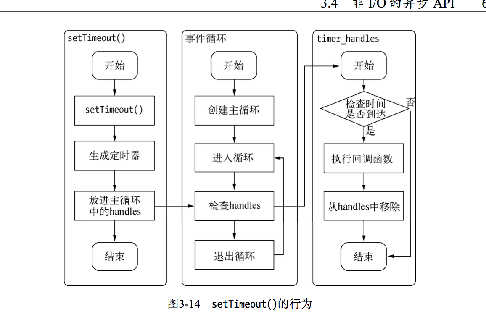

# 为什么要异步I/O

## 用户体验
web2.0-ajax
同步m+n=>异步max(m,n)

这就是异步I/O在Node中如此盛行，甚至将其作为主要理念进行设计的因。I/O是昂贵的，分布式I/O更是昂贵的。
只有后端能快速响应资源，才能让前端的体验变好

## 资源分配
计算机组件-I/O设备/计算设备
互不相关任务执行完成主要流行的两种方式：
1-单线程串行依次执行-易于表达，性能低，I/O等待会导致计算时间延长
2-多线程并行执行-开销大(golang例外)，有锁，同步问题，首选

Node-折中方案：利用单线程，远离多线程死锁，状态同步的问题；利用异步I/O,让单线程远离阻塞，以更好的利用cpu；为了弥补单线程无法充分利用多核cpu的缺点，node提供了类似前端浏览器的web workers的子进程，该进程可以通过工作
进程高效的利用CPU和I/O

## 异步I/O实现现状

### 异步I/O与非阻塞I/O
I/O-阻塞和非阻塞I/O
阻塞I/O-CPU等待浪费
非阻塞I/O-轮询结果造成CPU浪费

轮询技术如下：
1-read-重复检查I/O状态
2-select-文件描述符事件状态进行判断=》read=>select=>read-1024
3-poll-相似与select，采用链表结构，没有1024检查文件描述符限制，但是数量大，性能低下
4-epoll-linux下效率最高的I/O事件通知机制，利用了事件通知和执行回调，在通知前cpu进入休眠状态
5-kqueue-与epoll类似，仅存在FreeBSD系统

### 理想的非阻塞异步I/O
epoll-休眠期间cpu几乎是闲置的，理想发起非阻塞调用，直接处理下个任务，然后在上一个I/O完成时处理上一个任务
linux原生提供AIO方式，通过信号或者回调来传递数据，缺陷-只有linux下有，AIO仅支持内核I/O中的O_DIRECT方式度读取，导致无法利用系统缓存

### 现实中的异步I/O
 - 通过部分线程进行阻塞I/O或者非阻塞I/O加轮询技术来完数据获取，让一个线程进行计算处理，通过线程之间的通信将I/O得到的数据进行传递，这就轻松实现了异步I/O  
- node.js=>libuv=》*nix(自定义线程池)、windows(IOCP)
-  一个需要强调的地方在于我们时常提到Node是单线程的，这里的单线程仅仅只是JavaScript执行在单线程中罢了。在Node中，无论是*nix还是Windows  ，内部完成I/O任务的另有线程池


## Node的异步I/O

### 时间循环


### 观察者
在Node中，事件主要来源于网络请求、文件I/O等等，这些事件对应的观察者有文件I/O观察者、网络请求I/O观察者等。

### 请求对象
从JavaScript发起调用到内核执行完I/O操作的过渡的过程中， 存在一种中间产物，它叫做请求对象。
````   
req_wrap->object_->Set(oncomplete_sym, callback);  
QueueUserWorkItem(&uv_fs_thread_proc, \ req, \WT_EXECUTEDEFAULT）
````
请求对象是异步I/O过程中的重要中间产物，所有的对象都保存在这个对象中，包括送入线
程池等待执行以及I/O操作完毕后的回调处理

### 执行回调
windows-线程池中的I/O操作调用完毕之后，会将获取的结果存储在req->result属性上，然后调用PostQueuedCompletionStatus()通知IOCP，告知当前对象操作已经完成：
````
PostQueuedCompletionStatus((loop)->iocp, 0, 0, &((req)->overlapped))   
````
PostQueuedCompletionStatus()方法的作用是向IOCP提交执行状态，并将线程归还线程池。 
过PostQueuedCompletionStatus()方法提交的状态，可以通过GetQueuedCompletionStatus()提取。

在这个过程中，我们其实还动用了事件循环的I/O观察者。在每次Tick的执行中，它会调用 IOCP相关的GetQueuedCompletionStatus()方法检查线程 中是否有执行完的请求，如果存在，会将请求对象加入到I/O观察者的队列中，然后将其当做事件处理。 

I/O观察者回调函数的行为就是取出请求对象的result属性作为参数，取出oncomplete_sym 
性作为方法， 然后调用执行，以此达到调用JavaScript中传入的回调函数的目的。 至此，整个异步I/O的流程完全结束。


事件循环，观察者，请求对象和I/O线程池这四者共同构成了Node异步I/O模型的基本要素

### 小结
事实上，在Node中，除了JavaScript是单线线程外，Node自身其实是多线程的，只是I/O线程使用的CPU较少。另一个需要重视的观点是，除了用户代码无法并行执行外，所有的I/O(磁盘I/O和网络I/O等)则是可以并行起来的。 


## 非I/O的异步API
setTimeout()、setInterval()、 setImmediate()和process.nextTick()    

### 定时器
 用setTimeout()或者setInterval()创建的定时器会被插入到定时器观察者内部的一个红黑树中。每次Tick执行时，会从该红黑树中迭代选取定时器对象，检查是否超过定时时间，如果超过，就形成一个事件，它的回调函数将立即执行
 问题-并非十分精确，一个任务10ms后执行，但是9ms的时候有一个任务占用了5ms的cpu时间片，再次轮到定时器执行的时候已经超时4ms了
 

### process.nextTick()
process.nextTick()方法的操作相对setTimeout相对较为轻量：

````
process.nextTick = function(callback) { // on the way out, don't bother.
// it won't get fired anyway
if (process._exiting) return;
if (tickDepth >= process.maxTickDepth) maxTickWarn();
var tock = { callback: callback };
if (process.domain) tock.domain = process.domain; nextTickQueue.push(tock);
if (nextTickQueue.length) {
process._needTickCallback(); }
};
```` 

### setImmediate()

setImmediate()方法与process.nextTick()方法十分相似，都是将回调函数延迟执行。
但process.nextTick()方法执行的优先级要高于setImmediate()方法
> process.nextTick()属于idle观察者， setImmediate()属于check观察者。在每一个循环检查中，idle观察者优于I/O观察者，I/O观察者优于check观察者


# 事件驱动与高性能服务器
事件驱动的本质-主循环加事件触发的方式


经典web服务器模型：
1-同步式-一次处理一个请求
2-每进程/每请求-系统资源有限
3-每线程/没请求-比2块，但是系统资源有限

Node采用事件驱动，无须额外创建线程，可以省掉创建和销毁线程的开销


