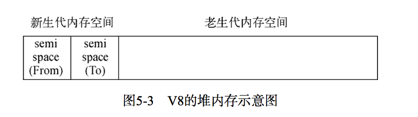

# v8的垃圾回收机制与内存机制

## node与v8
在Node中通过JavaScript 使用内存时就会发现只能使用部分内存(64位系统下约为1.4 GB，32位系统下约为0.7 GB)

## v8的对象分配
node->process.memoryUsage()
限制堆内存大小->防止垃圾回收耗时过长（一般50ms-1s),是的javascript线程执行暂停，应用性能和响应能力直线下降
设置限制：
````
node --max-old-space-size=1700 test.js // 单位为MB
node --max-new-space-size=1024 test.js // 单位为KB
````

## v8的垃圾回收机制

### v8主要的垃圾回收算法

- v8的内存分代
新生代-存活时间较短的对象 老生代-存活时间较长或者常驻内存的对象
Page::kPageSize-约为1MB
````
// semispace_size_ should be a power of 2 and old_generation_size_ should be 
// a multiple of Page::kPageSize
#if defined(V8_TARGET_ARCH_X64)
#define LUMP_OF_MEMORY (2 * MB)
code_range_size_(512*MB), 
#else
#define LUMP_OF_MEMORY MB code_range_size_(0),
#endif
#if defined(ANDROID)
reserved_semispace_size_(4 * Max(LUMP_OF_MEMORY, Page::kPageSize)), 
max_semispace_size_(4 * Max(LUMP_OF_MEMORY, Page::kPageSize)), 
initial_semispace_size_(Page::kPageSize), 
max_old_generation_size_(192*MB), 
max_executable_size_(max_old_generation_size_),
#else
reserved_semispace_size_(8 * Max(LUMP_OF_MEMORY, Page::kPageSize)), 
max_semispace_size_(8 * Max(LUMP_OF_MEMORY, Page::kPageSize)), 
initial_semispace_size_(Page::kPageSize), 
max_old_generation_size_(700ul * LUMP_OF_MEMORY), 
max_executable_size_(256l * LUMP_OF_MEMORY),
#endif

// Returns the maximum amount of memory reserved for the heap. For // the young generation, we reserve 4 times the amount needed for a // semi space. The young generation consists of two semi spaces and // we reserve twice the amount needed for those in order to ensure // that new space can be aligned to its size
intptr_t MaxReserved() {
    return 4 * reserved_semispace_size_ + max_old_generation_size_;
}
````
 默认认情况下，v8内存的最大值在64位系统上为1464MB，32位系统上则为732MB

 - Scavenge算法
 > 具体实现中主要采用了cheney算法-两个空间(semispace)一个空闲，一个使用，在回收后，空闲使用，使用空闲形成角色倒换
 > 缺点-只能使用堆内存的一半，优点-生名周期短的场景在时间效率上有优异表现，适合新生代内存空间

 

 当一个对象经过多次复制依然存活时，它将会被认为是生命周期较长的对象，这种对象随后将会被移动到老生代中， 这个过程称为晋升
 对象晋升的条件主要有两个，一个是对象是否经过Scavenge回收，一个是To空间的内存占用比超过限制(25%)

 - Mark-Sweep & Mark-Compact算法
 Mark-Sweep-标记清除算法，标记活着的对象，死的对象清理掉，优点高效不浪费空间，缺点内存空间会出现不连续状态
 Mark-Compact-Mark-Sweep基础演变而来，在清理的时候将或者的对象往一端移动，移动完成后直接清理掉边界外的内存,但是执行速度最慢
 

 - 增量标记- v8采用增量标记，减少垃圾回收的停顿时间


 ## 查看垃圾回收日志
 node --trace_gc 查看垃圾回收日志
 node --prof 可以参看v8执行时的性能分析数据，存到v8.log
 node-tick-processor v8.log 对日志信息统计数据

# 高效使用内存

## 作用域

### 标识符查找
````
var bar = function () { 
    console.log(local);
};
````
当前作用域没找到向上级作用域查找

### 作用域链
````
var foo = function() {
    var local = 'local var';
    var bar = function() {
        var local = 'another var';
        var baz = function() {
            console.log(local);
        };
        baz();
    };
    bar();
};
foo();
````
持续由内作用域到外作用域查找形成一个作用域链

### 变量的主动释放
- 释放常驻内存对象
1-通过delete操作删除引用关系
2-给对象重新赋值，让旧对象脱离引用关系
````
global.foo = "I am global object";
console.log(global.foo); // => "I am global object" 
delete global.foo;
//  者重   
global.foo = undefined; // or null 
console.log(global.foo); // => undefine
````

### 闭包
````
var foo = function() {
    var local = "局部变量";
    (function() {
        console.log(local); //可以访问
    }());
};

var foo = function() {
    (function() {
        var local = "局部变量";
    }());
    console.log(local); //不可访问
};

var foo = function() {
    var bar = function() {
        var local = "局部变量"; //闭包里变量不会立即释放
        return function() {
            return local;
        };
    };
    var baz = bar();
    console.log(baz()); //可以访问local
};
````
在正常的javascript运行中，无法立即回收的内存有闭包和全局变量引用这两种情况，所以要小心使用。

# 内存指标

##  查看内存使用情况

### 查看进程中的内存占用
调用 process.memoryUsage()
````
$ node
> process.memoryUsage() 
{ 
    rss: 13852672,
    heapTotal: 6131200, 
    heapUsed: 2757120 
}
````
rss-常驻内存部分, heapTotal:堆中总共申请的内存量   heapUsed：目前堆中使用中的内存量 单位字节

````
var showMem = function() {
    var mem = process.memoryUsage();
    var format = function(bytes) {
        return (bytes / 1024 / 1024).toFixed(2) + ' MB';
    };
    console.log('Process: heapTotal ' + format(mem.heapTotal) +
        ' heapUsed ' + format(mem.heapUsed) + ' rss ' + format(mem.rss));
    console.log('-----------------------------------------------------------');
};


var useMem = function() {
    var size = 20 * 1024 * 1024;
    var arr = new Array(size);
    for (var i = 0; i < size; i++) {
        arr[i] = 0;
    }
    return arr;
}
var total = [];
for (var j = 0; j < 15;j++) {
     showMem(); 
     total.push(useMem());
}
showMem();

Process: heapTotal 7.35 MB heapUsed 4.21 MB rss 23.19 MB
-----------------------------------------------------------
Process: heapTotal 167.36 MB heapUsed 164.25 MB rss 184.59 MB
-----------------------------------------------------------
Process: heapTotal 327.38 MB heapUsed 324.25 MB rss 344.63 MB
-----------------------------------------------------------
Process: heapTotal 487.39 MB heapUsed 484.26 MB rss 504.68 MB
-----------------------------------------------------------
Process: heapTotal 647.40 MB heapUsed 644.26 MB rss 664.72 MB
-----------------------------------------------------------
Process: heapTotal 807.41 MB heapUsed 804.26 MB rss 824.73 MB
-----------------------------------------------------------
Process: heapTotal 967.42 MB heapUsed 964.26 MB rss 984.84 MB
-----------------------------------------------------------
Process: heapTotal 1127.43 MB heapUsed 1124.27 MB rss 1144.86 MB
-----------------------------------------------------------
Process: heapTotal 1287.45 MB heapUsed 1284.27 MB rss 1304.87 MB
-----------------------------------------------------------

<--- Last few GCs --->

[22093:0x102801c00]     1137 ms: Mark-sweep 1284.0 (1290.9) -> 1284.0 (1290.9) MB, 136.2 / 0.1 ms  allocation failure GC in old space requested
[22093:0x102801c00]     1263 ms: Mark-sweep 1284.0 (1290.9) -> 1283.9 (1287.9) MB, 125.7 / 0.0 ms  last resort GC in old space requested
[22093:0x102801c00]     1382 ms: Mark-sweep 1283.9 (1287.9) -> 1283.9 (1287.9) MB, 119.6 / 0.0 ms  last resort GC in old space requested
````

### 查看系统的内存占用
与process.memoryUsage()不同的是，os模块中的totalmem()和freemem()这两个方法用于查看操   
作系统的内存的使用情况，它们分别返回系统的总内存和闲置内存，以字节为单位
````
node
> os.totalmem() //系统总内存
17179869184
> os.freemem() //闲置内存
1975930880
> 
````

## 堆外内存
通过process.momoryUsage()的使用，发现堆中内存的使用总量总是小于进程的常用内存总量，意味着node中的内存使用并非都是通过v8进行分配的
。不通过v8分配的内存称为堆外内存
改造useMem()方法：
````
var showMem = function() {
    var mem = process.memoryUsage();
    var format = function(bytes) {
        return (bytes / 1024 / 1024).toFixed(2) + ' MB';
    };
    console.log('Process: heapTotal ' + format(mem.heapTotal) +
        ' heapUsed ' + format(mem.heapUsed) + ' rss ' + format(mem.rss));
    console.log('-----------------------------------------------------------');
};


var useMem = function() {
    var size = 200 * 1024 * 1024;
    var buffer = new Buffer(size);
    for (var i = 0; i < size; i++) {
        buffer[i] = 0;
    }
    return buffer;
};
var total = [];
for (var j = 0; j < 15; j++) {
    showMem();
    total.push(useMem());
}
showMem();

Process: heapTotal 7.35 MB heapUsed 4.21 MB rss 23.45 MB
-----------------------------------------------------------
Process: heapTotal 7.35 MB heapUsed 4.25 MB rss 224.95 MB
-----------------------------------------------------------
Process: heapTotal 7.35 MB heapUsed 4.26 MB rss 425.28 MB
-----------------------------------------------------------
Process: heapTotal 9.35 MB heapUsed 3.96 MB rss 625.66 MB
-----------------------------------------------------------
Process: heapTotal 9.35 MB heapUsed 3.97 MB rss 825.69 MB
-----------------------------------------------------------
Process: heapTotal 9.35 MB heapUsed 3.97 MB rss 1025.69 MB
-----------------------------------------------------------
Process: heapTotal 9.35 MB heapUsed 3.96 MB rss 1225.88 MB
-----------------------------------------------------------
Process: heapTotal 9.35 MB heapUsed 3.96 MB rss 1425.89 MB
-----------------------------------------------------------
Process: heapTotal 9.35 MB heapUsed 3.97 MB rss 1625.89 MB
-----------------------------------------------------------
Process: heapTotal 9.35 MB heapUsed 3.96 MB rss 1825.91 MB
-----------------------------------------------------------
Process: heapTotal 9.35 MB heapUsed 3.96 MB rss 2025.93 MB
-----------------------------------------------------------
Process: heapTotal 9.35 MB heapUsed 3.97 MB rss 2225.93 MB
-----------------------------------------------------------
Process: heapTotal 6.35 MB heapUsed 3.93 MB rss 2425.93 MB
-----------------------------------------------------------
Process: heapTotal 6.35 MB heapUsed 3.94 MB rss 2624.89 MB
-----------------------------------------------------------
Process: heapTotal 6.35 MB heapUsed 3.94 MB rss 2824.90 MB
-----------------------------------------------------------
Process: heapTotal 6.35 MB heapUsed 3.94 MB rss 3024.93 MB
````

rss远超v8内存限制，可见buffer使用的是堆外内存

# 内存泄漏

## 慎将内存当缓存
一下这种只能少量使用
````
var cache = {};
var get = function(key) {
    if (cache[key]) {
        return cache[key];
    } else {
        // get from otherwise
    }
};
var set = function(key, value) {
    cache[key] = value;
};
````

### 缓存限制策略
````
var LimitableMap = function(limit) {
    this.limit = limit || 10;
    this.map = {};
    this.keys = [];
};
var hasOwnProperty = Object.prototype.hasOwnProperty;
LimitableMap.prototype.set = function(key, value) {
    var map = this.map;
    var keys = this.keys
    if (!hasOwnProperty.call(map, key)) {
        if (keys.length === this.limit) {
            var firstKey = keys.shift();
            delete map[firstKey];
        }
        keys.push(key);
    }
    map[key] = value;
};
LimitableMap.prototype.get = function(key) {
    return this.map[key];
};
module.exports = LimitableMap;
````
这种策略可以使用在应用场景小的地方

````
var leakArray = [];
exports.leak = function() {
    leakArray.push("leak" + Math.random());
};
````
由于模块缓存限制，上述代码中变量会常驻内存，请添加清空队列的接口，以供调用者释放内存

注意进程之间无法共享内存

### 缓存的解决方案
如何大量缓存，目前比较好的方案是采用进程外的缓存，进程自身不存储状态，这样可以让垃圾回收高效，另外可实现进程间共享缓存。
推荐缓存Redis和Memcached

## 关注队列状态
队列经常在消费者-生产者模型中经常充当中间产物，如果生产速度激增或者消费速度因为突然故障降低，队列堆积，内存泄漏是可能出现的。

深度的解决方案应该是监控队列的长度，一旦堆积，应当通过监控系统产生报警并通知相关的人员 。另一个解决方案是任意异步调用都应该包含超时时机 ，一旦在 限定的时间内未完成响应，通过回调函数传递超时异常，使得任意异步调用的回调都具备可控的响应时间，给消费者速度一个下限值。
对于Bagpipe而言，它提供了超时模式和拒绝模式。启用超时模式时，调用加入到队列中就开始计时，超时就直接响应一个超时错误。 启用拒绝模式时，新到来的 用会直接响应拥塞错误。这两种模式都能够有效的防止队列拥塞导致的内存泄漏问题

# 内存泄漏排查
常用的内存工具
- v8-profiler-已3年不维护
- node-heapdump
- node-mtrace
- dtrace
- node-memwatch

## node-heapdump
内存泄漏代码
````
var leakArray = [];
var leak = function() {
    leakArray.push("leak" + Math.random());
};
http.createServer(function(req, res) {
    leak();
    res.writeHead(200, { 'Content-Type': 'text/plain' });
    res.end('Hello World\n');
}).listen(1337);
console.log('Server running at http://127.0.0.1:1337/');
````

安装node-heapdump =》npm install heapdump
在代码中加入var heapdump = require('heapdump');
=>发送命令 kill -USR2 <pid>，会在目录下以heapdump-<sec>.<usec>.heapsnapshot格式存储快照，通过chrome开发者工具打开查看，
可以找到泄漏的数据，然后根据这些信息找到造成的泄漏的代码

## node-memwatch
npm install node-memwatch
内存泄漏代码
````
var memwatch = require('memwatch');
memwatch.on('leak', function(info) {
    console.log('leak:');
    console.log(info);
});
memwatch.on('stats', function(stats) {
    console.log('stats:') console.log(stats);
});

var http = require('http');
var leakArray = [];
var leak = function() {
    leakArray.push("leak" + Math.random());
};
http.createServer(function(req, res) {
    leak();
    res.writeHead(200, { 'Content-Type': 'text/plain' });
    res.end('Hello World\n');
}).listen(1337);
console.log('Server running at http://127.0.0.1:1337');
````

### stats事件
每次进行全堆垃圾回收的时候，会触发一次stats事件，这个事件将会传递内存的统计信息
````
stats:
{ num_full_gc: 4, //第几次全堆垃圾回收
num_inc_gc: 23, // 第几次增量垃圾回收 
heap_compactions: 4, //第几次对老生代进行整理 
usage_trend: 0, // 使用趋势
estimated_base: 7152944, // 预估基数 
current_base: 7152944, // 当前基数
min: 6720776, //  最小
max: 7152944 //  最大 
} 
````

### leak事件
  经过连续5次垃圾回收后，内存仍然没有释放，这意味着有内存泄漏的产生，
node-memwatch会发出一个leak事件,能显示5次垃圾回收过程中内存增长了多少：
````
leak:{
    start: Mon Oct 07 2013 13: 46: 27 GMT + 0800(CST),
    end: Mon Oct 07 2013 13: 54: 40 GMT + 0800(CST),
    growth: 6222576,
    reason: 'heap growth over 5 consecutive GCs (8m 13s) - 43.33 mb/hr'
}
````

### 堆内存比较
捕捉快照
````
var memwatch = require('memwatch');
var leakArray = [];
var leak = function() {
    leakArray.push("leak" + Math.random());
};
// Take first snapshot
var hd = new memwatch.HeapDiff();
for (var i = 0; i < 10000; i++) {
    leak();
}
// Take the second snapshot and compute the diff 
var diff = hd.end();
console.log(JSON.stringify(diff, null, 2));
````
node diff.js 可以看到每种类型数据的分配和释放量，从而可推算出问题


# 大内存应用
由于Node的内存限制，操作大文件也需要小心，好在Node提供了stream模块用于处理大文件
实例如下：
````
var reader = fs.createReadStream('in.txt');
10
var writer = fs.createWriteStream('out.txt');
reader.on('data', function(chunk) {
    writer.write(chunk);
});
reader.on('end', function() {
    writer.end();
});
````
由于读写模型固定，有更简洁的方式，如下
````
var reader = fs.createReadStream('in.txt');
var writer = fs.createWriteStream('out.txt');
reader.pipe(writer);
````

可读流提供了管道方法pipe()，封装了data事件和写入操作。 通过流的方式，上述代码不会受到V8内存限制的影响，有效的提高了程序的健壮性。
如果不需要进行字符串层面的操作，则不需要借助V8处理，可以尝试进行纯粹的Buffer操作，这不会受到V8堆内存的限制。但是这种大片使用内存的情况要小心， 即使V8不限制堆内存的大小，物理内存依然有限制。  


