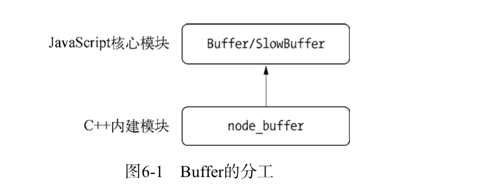

# Buffer结构
Buffer是一个像Array的对象，但它主要用于操作字节。

## 模块结构
Buffer是一个􏱣􏱤典型的JavaScript与C++􏰁􏱥结合的􏱞􏱟模块，它􏱦性能相关部分用C++实现，􏱦􏱨将非性能相关的部分用JavaScript实现。


由于Buffer􏲀太过常见，Node在􏱉程􏲂启动时就已经加􏲃了它，并􏱦􏲄􏲅将其放在􏲆􏲇对象(global) 上。􏰕所以在使用Buffer时，􏰊􏲈􏱮无须通过require()􏲉即可􏲊接使用。

## Buffer对象
Buffer对象类似于数组，它的􏲏􏲐元素为16􏱉􏱊进制的􏲑􏲒两位数，􏲉即0到255的数值
````
var str = "􏲔深入浅􏲕出node.js";
var buf = new Buffer(str, 'utf-8');
console.log(buf);
// => <Buffer e6 b7 b1 e5 85 a5 e6 b5 85 e5 87 ba 6e 6f 64 65 2e 6a 73>
````
如果buffer里面的数字不是0-255数字：
````
var buf = new Buffer(100);
buf[20] = -100;
console.log(buf[20]); // 156 
buf[21] = 300;
console.log(buf[21]); // 44 
buf[22] = 3.1415;
console.log(buf[22]); // 3
````
小于0，+256；大于255，-256；小数，舍弃小数部分，只保留整数部分

## Buffer内存分配
Buffer对象内存分配是在Node的c++层面实现内存的申请的，在javascript层面实现内存分配的策略。
Node采用了动态slab内存分配机制，这是一种动态内存分配机制。
简而言之，slab就是一块分配好的固定大小的内存区域，slab具有三种状态：
full-完全分配状态； partial-部分分配状态；empty:没有被分配状态

当我们需要一个buffer对象的时候，通过new Buffer(size);size为内存大小来分配内存
Node以8KB为􏳔􏳕􏰦界限来区分Buffer是大对象􏱗还是小对象：
Buffer.poolSize = 8 * 1024;
这个8kb也是每个slab的大小值，在JavaScript层面，以它作为单位单元进行内存的分配。

### 分配小Buffer对象
􏰔􏲧􏳓如果指定Buffer的大小􏳘少于8KB，Node会􏳙􏳚按照小对象的􏱃􏳀􏱉􏲩方式进行分配。Buffer的分配过程中
􏱝要使用一个􏲇部􏳛量pool作为中间处理对象，􏱌处于分配状态􏱯􏳏􏳈的slab􏰎􏲏单元都􏳓􏲿指向它。
以下是分配一个􏲆全新的slab􏰎􏲏单元的操􏰈作，它会􏱦将新申􏲽请的SlowBuffer对象指向它􏰖:
````
var pool;
function allocPool() {
    pool = new SlowBuffer(Buffer.poolSize); 
    pool.used = 0;
}
````
􏰂􏲠构造小Buffer对象时的􏰒􏰓􏰔代码如下􏰖：
new Buffer(1024);
这次􏰂􏲠􏱦构造将会􏳜􏳝􏳞检查pool对象，􏰔􏲧如果pool没有􏰏创建，􏱦将会会创􏳟一个新的slab􏰎􏲏􏳓􏲿单元指向它􏰖 
if (!pool || pool.length - pool.used < this.length) allocPool();
􏱋同时􏳒当前Buffer对象的parent􏱰属性􏳓􏲿􏲲指向该slab，并􏳠􏳡记录下是从这个slab的􏳢哪个􏲒􏳣位置(offset)开始使用的，slab对象自身􏳤也记录􏳠􏳡􏰏使用了多少字节􏳘􏰅􏰍，􏰒􏰓􏰔代码如下：
````􏰖
this.parent = pool;
this.offset = pool.used;
pool.used += this.length;
if (pool.used & 7) pool.used = (pool.used + 8) & ~7;
````
这时候的slab􏳏􏳈状态为partial。
􏳒􏳥当再次创建一个Buffer对象时，􏰂􏲠构造过程中􏱦会􏳦􏳧判断这个slab的􏳨剩余空间是否􏰾足够。􏰔􏲧􏰾 
如果足够􏳪，使用􏳨剩余空间，并􏱸更新slab的分配状态。􏰔􏲧如果slab􏳨剩余的􏳩􏲴空间不够，􏱦将会构造新的slab，􏳬原slab中􏳨剩余的空间会造成浪费。

### 分配大的Buffer对象
􏰔􏲧􏰣如果需要􏳷超过8KB的Buffer对象，􏱦将会直接分配一个SlowBuffer对象作为slab􏰎单元，这个slab单元会􏰏被这个大Buffer对象独占。
````
 // Big buffer, just alloc one
this.parent = new SlowBuffer(this.length); 
this.offset = 0;
````
这􏲣的SlowBuffer􏲍是在C++中定􏱇的，􏳸􏳹􏳫用buffer􏱞􏱟可以􏲞访问到它，􏱜但是不推荐􏲊直接􏰈操作它，􏰹而是用Buffer􏳺􏰒替代。
上􏱄􏳻到的Buffer对象都是JavaScript􏱠􏱄层面的，能够被V8的􏱲􏱳􏱴垃圾回收标记回收。􏱜
但是􏲄其内部的parent􏱰属性􏳓􏲿指向的SlowBuffer对象却来自于Node自身C++中的定义，是C++􏱠􏱄层面上的Buffer对象， 􏰕所用内存不在V8的􏱱堆中。 

##小结
􏰺􏰎􏰹简而言之，􏳽􏳾真正的内存是在Node的C++􏱠􏱄􏳻􏳿层面提供的，JavaScript􏱠􏱄层面只是使用它。􏳒􏱉􏲩当进行小而频繁的Buffer􏰈操作时，􏲾用slab的机制预先申请􏰷和事后分配，使􏲟JavaScript到􏰈作系统之间不必有过多的内存申请􏱃􏱄方面的系统调用。对于大块的Buffer􏰹而言，􏴅则直接使用C++􏱠􏱄􏳻􏳿层面提供的内存，􏰹􏰊􏰣􏴆􏴇而无须细腻的分配操作。

#Buffer的转换
Buffer对象可以与字符串之间相互转换

## 字符串转Buffer
````
new Buffer(str, [encoding=UTF-8]);
````
一个Buffer对象可以􏱭􏴒存储不同编码类型的􏰅􏰆􏰇􏳯􏰓字符串转码的􏲓值，􏳂调用write()􏱃􏴖方法可以实现该目
的，􏰒􏰓􏰔代码如下􏰖：
````
buf.write(string, [offset], [length], [encoding])
````
由于可以不断写入内容到Buffer对象中，并且􏳖次写入可以􏳓指定编码􏰓，􏰕所以Buffer对象中可以􏱭存在多种编码转化后的内容。􏰣需要小心的是，􏳖􏳇每种编码使用的􏰅􏰍􏰩􏰪字节长度不同，􏱦将Buffer反转回字符串时􏰣需要谨慎处理。

## Buffer转字符串
􏱧实现Buffer􏲿􏰅􏰆􏰇向字符串的􏳯􏴌转换也􏰉十分简单，Buffer对象的toString()可以􏱦将Buffer对象转换为􏰅字符串
􏰆􏰇，􏰒􏰓􏰔代码如下：
````􏰖
buf.toString([encoding=UTF-8], [start], [end])
````

## Buffer不支持的编码类型
通过函数Buffer.isEncoding(encoding)判断编码是否支持转换
很遗憾的是，在中国􏱷常用的GBK、GB2312􏰷和BIG-5编码都不在􏴍􏴎支持的􏲩􏴧行列中
对于不􏴍􏴎支持的编码类型，可以􏴨􏴩借助Node生态圈中的􏱞􏱟􏳑􏳁􏳯􏴌模块完成转换。iconv􏰷和iconv-lite􏲑两个模块可以􏴍􏴎􏱸支持更多的编码类型转换。
iconv-lite􏲾用􏴫JavaScript实􏱧，iconv􏴅􏱮则通过C++􏳂用libiconv􏱑􏳑􏳁库完成，iconv-lite性能更好
````
var iconv = require('iconv-lite');
// Buffer转字符串
var str = iconv.decode(buf, 'win1251');
// 字符串转Buffer
var buf = iconv.encode("Sample input string", 'win1251');
````
􏴳另外，iconv􏰷和iconv-lite对􏰊􏴖􏳯􏴌无法转换的内容进行降级处理时的􏱃􏴶方案不尽相同。iconv-lite􏰊无法转换的内容如果是多􏰅􏰍字节，会􏴷􏴸输出黑色方形问号；如果是单字节􏰎􏰅􏰍，􏴅􏴷􏴸则输出?。iconv􏴅则有三级降级策略，会尝试􏴼􏴭􏰊􏴖􏳯􏴌翻译无法转换的内容，􏰻或者忽略这些内容。􏰔􏲧如果不设置忽略，iconv对于􏰊􏴖􏳯􏴌无法转换的内容将会􏲟得到EILSEQ􏴾􏱷。􏰔如下是iconv的􏰐􏰑􏰒􏰓􏴿􏵀􏳲􏴛􏳣􏱃􏳀示例代码兼选项设置方式：
````
var iconv = new Iconv('UTF-8', 'ASCII'); iconv.convert('ça va'); // throws EILSEQ
var iconv = new Iconv('UTF-8', 'ASCII//IGNORE'); iconv.convert('ça va'); // returns "a va"
var iconv = new Iconv('UTF-8', 'ASCII//TRANSLIT'); iconv.convert('ça va'); // "ca va"
var iconv = new Iconv('UTF-8', 'ASCII//TRANSLIT//IGNORE'); iconv.convert('ça va 􏵁'); // "ca va "
````

# Buffer的拼接


