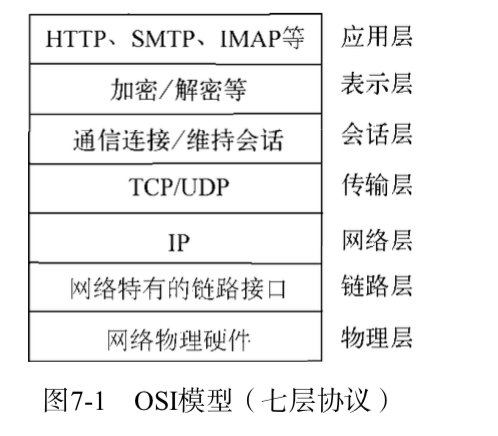

# 构建TCP服务

##  TCP
TCP全名为传输控制协议，在OSI模型中属于传输层协议，许多应用协议基于TCP构建，典型的是HTTP,SMTP,IMAP等协议。七层协议示意图如图7-1所示。


TCP是面向连接的协议，其显著的特征是在传输之前需要3次握手协议。只有会话形成后，服务端和客户端之间才能互相发送数据，在创建会话的过程中，服务器端和客户端分别提供一个套接字。这两个套接字共同形成一个连接。服务端和客户端则通过套接字实现两者之间连接的操作。

## 创建TCP服务器端
````
const net = require('net');
const server = net.createServer((c) => {
  // 'connection' listener
  console.log('client connected');
  c.on('end', () => {
    console.log('client disconnected');
  });
  c.write('hello\r\n');
  c.pipe(c);
});
server.on('error', (err) => { //一定加上错误处理，不然会报错
  throw err;
});
server.listen(8124, () => {
  console.log('server bound');
});
````

用 telnet测试:

telnet localhost 8124


我们通过net.createServer(listener)即可创建一个tcp服务，listener是连接事件connection的侦听器，也可以采用如下方式进行侦听。
````
var server = net.createServer();
server.on('connection', function(c) {
    console.log('client connected');
  c.on('end', () => {
    console.log('client disconnected');
  });
  c.write('good\r\n');
  c.pipe(c);
});
server.listen(8124);
````
除了端口外，同样我们可以对Domain socket进行监听，代码如下
````
server.listen('/tmp/echo.sock');
nc -U /tmp/echo.sock
````

## 创建TCP客户端
````
var net = require('net');
var client = net.connect({ port: 8124 }, function() {
    console.log('client connected');
    client.write('world!\r\n');
});
client.on('data', function(data) {
    console.log(data.toString());
    client.end();
});
client.on('end', function() {
    console.log('client disconnected');
});

client.on("error", function(err) {
    throw err;
})
````
其结果用Telnet􏱲和nc的会话结果并无差别。如果Domain Socket，在填写选项的时候，填写path即可，代码如下：
````
var client = net.connect({path: '/tmp/echo.sock'});
````

## TCP服务的事件
分为服务器事件和连接事件。

### 服务器事件
listening，connection，close（当服务器关闭时触发，服务器将停止所有新的套接字连接，但保持当前存在的连接，等待所有的连接都断开后，会触发该事件），error

### 连接事件
data,end,connect,drain(当任意一端调用write()发送数据时，当前这端会触发该事件)，error,close,timeout(当一定时间连接不再活跃时，该事件将会触发，通知当前用户该链接已经被闲置了)。
由于tcp套接字是可写可读的stream对象，可以利用pipe()方法巧妙地实现管道操作，如下代码实现了一个echo服务器：
````
var net = require('net');
var server = net.createServer(function(socket) {
    socket.write('Echo server\r\n');
    socket.pipe(socket);
});
server.listen(1337, '127.0.0.1');
````
node默认开启nagle算法优化网，只有缓存区达到一定数量才会发送数据，这样虽然能够避免网络阻塞，但是同时也会延迟时间，如果需要关闭nagle算法，可以通过
socket.setNoDelay(true)去掉nagle算法，使得write()可以立即发送到网络中。

另一个需要注意的是，尽量在网络的一端调用write()会触发另一端的data事件，但是并不意味着每次write()都会触发一次data事件，在关闭掉nagle算法后，另一端可能会接收到的多个小数据包合并，然后只触发一次data事件。


