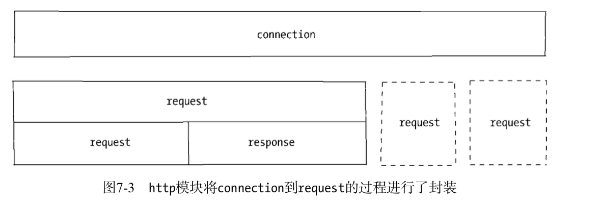

# 构建TCP服务

##  TCP
TCP全名为传输控制协议，在OSI模型中属于传输层协议，许多应用协议基于TCP构建，典型的是HTTP,SMTP,IMAP等协议。七层协议示意图如图7-1所示。


TCP是面向连接的协议，其显著的特征是在传输之前需要3次握手协议。只有会话形成后，服务端和客户端之间才能互相发送数据，在创建会话的过程中，服务器端和客户端分别提供一个套接字。这两个套接字共同形成一个连接。服务端和客户端则通过套接字实现两者之间连接的操作。

## 创建TCP服务器端
````
const net = require('net');
const server = net.createServer((c) => {
  // 'connection' listener
  console.log('client connected');
  c.on('end', () => {
    console.log('client disconnected');
  });
  c.write('hello\r\n');
  c.pipe(c);
});
server.on('error', (err) => { //一定加上错误处理，不然会报错
  throw err;
});
server.listen(8124, () => {
  console.log('server bound');
});
````

用 telnet测试:

telnet localhost 8124


我们通过net.createServer(listener)即可创建一个tcp服务，listener是连接事件connection的侦听器，也可以采用如下方式进行侦听。
````
var server = net.createServer();
server.on('connection', function(c) {
    console.log('client connected');
  c.on('end', () => {
    console.log('client disconnected');
  });
  c.write('good\r\n');
  c.pipe(c);
});
server.listen(8124);
````
除了端口外，同样我们可以对Domain socket进行监听，代码如下
````
server.listen('/tmp/echo.sock');
nc -U /tmp/echo.sock
````

## 创建TCP客户端
````
var net = require('net');
var client = net.connect({ port: 8124 }, function() {
    console.log('client connected');
    client.write('world!\r\n');
});
client.on('data', function(data) {
    console.log(data.toString());
    client.end();
});
client.on('end', function() {
    console.log('client disconnected');
});

client.on("error", function(err) {
    throw err;
})
````
其结果用Telnet􏱲和nc的会话结果并无差别。如果Domain Socket，在填写选项的时候，填写path即可，代码如下：
````
var client = net.connect({path: '/tmp/echo.sock'});
````

## TCP服务的事件
分为服务器事件和连接事件。

### 服务器事件
listening，connection，close（当服务器关闭时触发，服务器将停止所有新的套接字连接，但保持当前存在的连接，等待所有的连接都断开后，会触发该事件），error

### 连接事件
data,end,connect,drain(当任意一端调用write()发送数据时，当前这端会触发该事件)，error,close,timeout(当一定时间连接不再活跃时，该事件将会触发，通知当前用户该链接已经被闲置了)。
由于tcp套接字是可写可读的stream对象，可以利用pipe()方法巧妙地实现管道操作，如下代码实现了一个echo服务器：
````
var net = require('net');
var server = net.createServer(function(socket) {
    socket.write('Echo server\r\n');
    socket.pipe(socket);
});
server.listen(1337, '127.0.0.1');
````
node默认开启nagle算法优化网，只有缓存区达到一定数量才会发送数据，这样虽然能够避免网络阻塞，但是同时也会延迟时间，如果需要关闭nagle算法，可以通过
socket.setNoDelay(true)去掉nagle算法，使得write()可以立即发送到网络中。

另一个需要注意的是，尽量在网络的一端调用write()会触发另一端的data事件，但是并不意味着每次write()都会触发一次data事件，在关闭掉nagle算法后，另一端可能会接收到的多个小数据包合并，然后只触发一次data事件。

# 构建UDP服务

## 创建UDP套接字
````
var dgram = require('dgram');
var socket = dgram.createSocket("udp4");
````
若想让UDP套接字接收网络消息，只要调用dgram.bind(port, [address])方法对网卡和端口进行绑定即可。以下为一个完整的服务器端示例：
服务端：
````
var dgram = require("dgram");
var server = dgram.createSocket("udp4");
server.on("message", function(msg, rinfo) {
    console.log("server got: " + msg + " from " +
        rinfo.address + ":" + rinfo.port);
});
server.on("listening", function() {
    var address = server.address();
    console.log("server listening " + address.address + ":" + address.port);
});
server.bind(41234);
````
客户端：
````
var dgram = require('dgram');
var message = new Buffer("深入浅出Node.js");
var client = dgram.createSocket("udp4");
client.send(message, 0, message.length, 41234, "localhost", function(err, bytes) {//
    client.close();
});
````
客户端发送参数：
socket.send(buf, offset, length, port, address, [callback])
与tcp套接字的write()相比，send()方法的参数列表相对复杂，但是他更灵活的地方在于可以随意发送数据到网络中的服务器端，而tcp如果要发送数据到另一个服务器端，则需要重新通过套接字构造新的连接。


## udp套接字事件
udp套接字相对于tcp套接字使用起来更简单，它只是一个eventemitter的实例，而非Stream的实例，它具备如下自定义事件：
- message:当udp套接字侦听网卡端口后，接收到消息时触发改事件，触发携带的数据为消息buffer对象和一个远程地址信息
- listening：当udp套接字开始侦听时触发该事件
- close:调用close()方法时触发改事件，并不再触发message事件。如需再次触发message事件，重新绑定即可
- error：当异常出现时触发该事件，如果不侦听，异常将直接抛出，使进程直接退出。

# 构建HTTP服务

## HTTP
- http构建在tcp之上，属于应用层协议，http得以发展是w3c和ietf两个组织合作的结果，他们最终发布了一系列的RFC标准，目前最知名的RFC标准是RFC 2616;
- http报文
````
$ curl -v http://127.0.0.1:1337
//经典的tcp三次握手
* About to connect() to 127.0.0.1 port 1337 (#0)
* Trying 127.0.0.1...
* connected
* Connected to 127.0.0.1 (127.0.0.1) port 1337 (#0)
//客户端向服务器端发送的请求报文
> GET / HTTP/1.1
> User-Agent: curl/7.24.0 (x86_64-apple-darwin12.0) libcurl/7.24.0 OpenSSL/0.9.8r zlib/1.2.5
> Host: 127.0.0.1:1337 > Accept: */*
>
//服务端发送给客户端的相应的内容，包括响应头和响应体
< HTTP/1.1 200 OK
< Content-Type: text/plain
< Date: Sat, 06 Apr 2013 08:01:44 GMT
< Connection: keep-alive
< Transfer-Encoding: chunked <
Hello World
//结束会话信息
* Connection #0 to host 127.0.0.1 left intact 
* Closing connection #0
````
从上述报文可以看出http的特点，它是基于请求响应式的，以一问一答的方式实现服务，虽然基于tcp会话，但是本身并无会话的特点。

## Http模块
node的http模块建立在tcp服务的基础上，由于采用事件驱动的方式，并不为每一个连接创建额外的线程或者进程，保持很低的内存占用，所以能够实现高并发。http与tcp服务模型有区别的地方在于，在开启keeplive后，一个tcp会话可以用于多次请求和响应。tcp服务以connection为单位进行服务，http是以request为单位进行服务。http模块即是将connection到request的过程进行了封装。


### Http请求
请求报文通过http_parser解析后可分成如下属性：
- req.method属性：值为GET
- req.url:值为/
- req.httpVersion属性：值为1.1 
其余报头是很规律的key:value格式，被解析后放置在req.headers属性上传递给业务逻辑以供调用，如下所示：
````
headers: 5 { 'user-agent': 'curl/7.24.0 (x86_64-apple-darwin12.0) libcurl/7.24.0 OpenSSL/0.9.8r zlib/1.2.5',
host: '127.0.0.1:1337', accept: '*/*' },
````
报文体部分则抽象为一个只读流对象，如果业务逻辑需要读取报文中的数据，则在这个数据流结束后才能进行操作：
````
function(req, res) {
    // console.log(req.headers);
    var buffers = [];
    req.on('data', function(trunk) {
        buffers.push(trunk);
    }).on('end', function() {
        var buffer = Buffer.concat(buffers); // TODO
        res.end('Hello world');
    });
}
````
http请求和http响应对象是相对较底层的封装，现行的web框架如connect和express都是在这两个对象上进行高层封装完成。

### http响应
http响应相对简单一些，它封装了对底层连接的写操作，可以将其看成一个可写的流对象。它影响报文头部信息的api为res.setheader()和res.writeHead().
在上述实例中，可以：
````
res.writeHead(200, {'Content-Type': 'text/plain'});
````
其分为setHeader()和writeHead()􏱎两个步骤。它在http模块下，实际生成如下报文：
````
HTTP/1.1 200 OK
Content-Type: text/plain
````
我们可以通过setheader进行多次设置，但只有调用writeHeader后，报头才会写入到连接中。除此之外，http会帮你设置一些头信息，如下所示：
````
< Date: Sat, 06 Apr 2013 08:01:44 GMT
< Connection: keep-alive
< Transfer-Encoding: chunked <
````
报文体部分则是调用res.write()和res.end()方法实现的，后者与前者的区别在于res.end()会调用write()发送数据，然后发送信息告诉服务器这次响应结束。响应结束后，http服务器可能会将当前的连接用于下一个请求，或者关闭连接。值得注意的是，报头是报文体发送前发送的，一旦开始了发送数据，writehead()和setheader()将不再生效。这由协议的特性决定的。另外，无论服务端在处理业务逻辑时是否发生异常，务必在结束时调用res.end()结束请求，否则客户端将一直处于等待的状态。

### HTTP服务的事件````

如果TCP服务一样，http服务器也抽象了一些事件，以供应用层使用，同样典型的是，服务器也是一个eventemitter实例：
- connection事件：底层tcp连接建立时，触发一次connection事件
- request事件：建立tcp连接后，http模块底层将在数据流中抽象出http请求和http响应，当请求数据发送到服务端，在解析出http请求后，将会触发该事件；在res.end()后，如果keep-alive打开时，tcp连接可能用于下一次请求响应。
- close事件：与tcp服务器一致，调用server.close()方法将停止接受新的连接，当所有连接都断开时，触发该事件；
- checkContinue事件：某些客户端在发送较大数据时，并不会将数据直接发送，而是先发送一个头部带Expect: 100-continue的请求到服务器，服务器将会触发checkContinue事件；如果没有为服务器监听这个事件，服务器将会自动响应客户端100 continue的状态码，表示接受数据上传；如果不接受数据的较多时，响应客户端400 bad request拒绝客户端继续发送数据即可。需要注意的是，当该事件发送时不会触发request事件，两个事件间互斥。当客户端收到100continue后重新发起请求时，才会触发request事件。
- connect事件：当客户端发送connect请求时触发，而发起connect请求通常在http代理时出现；如果不监听该事件，发起该请求的连接将会关闭。
- upgrade事件:客户端要求升级连接的协议时。
- clientError事件:连接的客户端触发error事件时，这个错误会传递给服务端，此时触发该事件。

### HTTP客户端
````
var options = {
    hostname: '127.0.0.1',
    port: 1334,
    path: '/',
    method: 'GET'
};
var req = http.request(options, function(res) {
    console.log('STATUS: ' + res.statusCode);
    console.log('HEADERS: ' + JSON.stringify(res.headers));
    res.setEncoding('utf8');
    res.on('data', function(chunk) {
        console.log(chunk);
    });
});
req.end();
````
执行上述代码，结果如下：
````
node client.js
STATUS: 200
HEADERS: {"date":"Sat, 06 Apr 2013 11:08:01 GMT","connection":"keep-alive","transfer-encoding":"chunked"} 
Hello World
````

